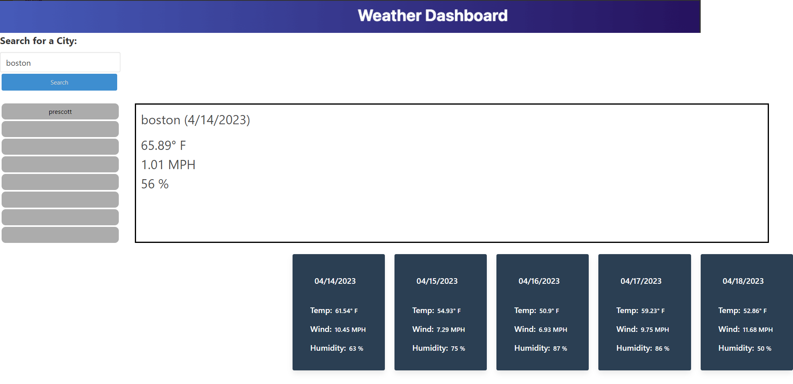
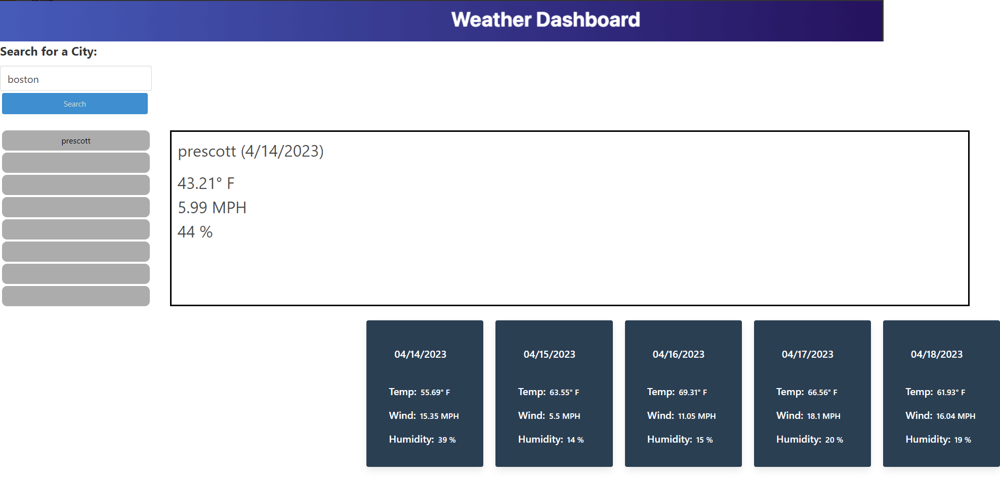

## Objective
Create an application that will allow a user check the weather conditions and forecast for multiple cities

## Acceptance Criteria
* Searched cities give current and future weather conditions
* Cities that were searched are added to search history, where data can once again be retrieved
* Current conditions will display the city name, the date, an icon representation of weather conditions, the temperature, the humidity, and the the wind speed.
* Future conditions will display a 5-day forecast that displays the date, an icon representation of weather conditions, the temperature, the wind speed, and the humidity

## Requirements
* App uses local storage to store persistent data
* Use the OpenWeather API to retrieve weather data for cities
* Application loads without error
* Repo follows best practice with multiple commits
* Quality README with description, Sreenshot, and Link to deployed app

## Is Complete When...
* Acceptance criteria is met 
* Requirments are satisfied

## Screenshot of Deployed Weather App

# Deployed Site

